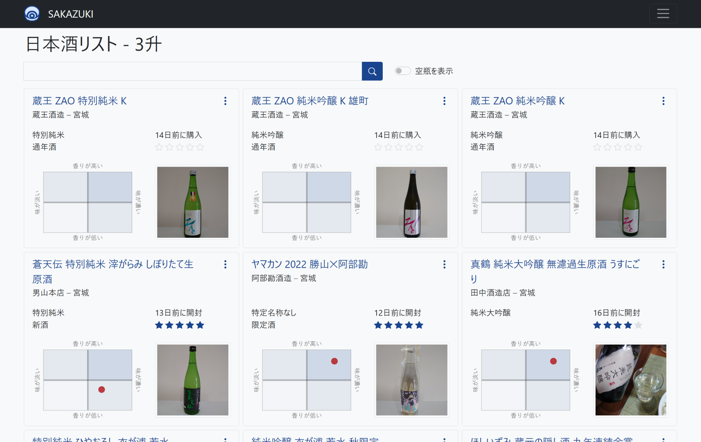

# SAKAZUKI


自宅の酒を管理するアプリケーション



## What is SAKAZUKI?

- 日本酒の在庫を登録・開封・空で管理
- スペックや味わいを定量値・定性値で保存
- 在庫や過去に飲んだ日本酒を全文検索
- 在庫量と総飲酒量の表示
- 複数人での在庫の共有

## Requirements

- Ruby = 3.0.2
- Bundler
- Yarn🐈 >= 1.22.4
- Node.js >= 12.20.1
- PostgreSQL >= 12.0
- ElasticSearch >= 7.10.2
  - Japanese (kuromoji) Analysis Plugin
  - ICU Analysis Plugin
- ImageMagick >= 6.9

## How to use

- 依存関係のインストール
  - `bundle install`
  - `yarn install`
- PostgreSQLの設定

```console
cp dotenv.example .env
```

```shell
# .env
POSTGRES_USERNAME=[YOUR POSTGRESQL NAME]
POSTGRES_PASSWORD=[YOUR POSTGRESQL PASSWORD]
```

- 管理者ユーザの設定（オプション）

```ruby
# db/seed.rb
User.create!(
  email: "[YOUR EMAIL ADDRESS]",
  password: "[YOUR ACCOUNT PASSWORD]",
  admin: true,
  confirmed_at: Time.current,
)
```

- 管理者ユーザの作成
  - `bundle exec rails db:seed`
- サーバの起動
  - `bundle exec rails server`
- SAKAZUKIへのアクセス
  - <http://localhost:3000/>にアクセス
  - デフォルトか前項内容でログイン
    - デフォルトメールアドレス: `example@example.com`
    - デフォルトパスワード: `rootroot`

### How to recieve EMail from SAKAZUKI in development environment

Development環境において、SAKAZUKIからのメール通知はletter_openerで確認する。

- <http://localhost:3000/letter_opener>にアクセス

## How to deploy to Heroku

SAKAZUKIのProduction環境はHerokuを対象にしている。
このときSAKAZUKIは画像をCloudinaryにアップロードする。
SAKAZUKIをHerokuで動かすには、メールとCloudinaryの設定がいる。
これらの設定はRailsのcredentialsを使って設定する。

```console
$ rm config/credentials/production.yml.enc config/credentials/production.key  # デフォルトの設定の削除
$ bundle exec rails credentials:edit --environment production
...編集画面が開く
```

```yaml
# config/credentials/production.yml.encの設定例
mail:
    smtp: "smtp.gmail.com"
    domain: "gmail.com"
    port: 587
    user_name: "[YOUR MAIL ADDRESS]@gmail.com"
    password: "[YOUR MAIL PASSWORD]"
cloudinary:
    cloud_name: [YOUR CLOUD NAME]
    api_key: [YOUR API KEY]
    api_secret: [YOUR API SECRET]
    enhance_image_tag: true
    static_file_support: false
```

- CredentialsのKeyをHerokuに登録
  - heroku-cliが必要

```console
$ heroku config:set RAILS_MASTER_KEY=$(cat config/credentials/production.key)
...
```

- HerokuにSAKAZUKIをデプロイする

## How to develop with Docker

レポジトリをDocker Bindするため、レポジトリをWSLファイルシステムに置くと動きません。

- Dockerイメージのビルド

```console
$ docker-compose build
...
```

- PostgreSQLコンテナ、ElasticSearchコンテナの初期設定

<!-- markdownlint-disable MD013 -->
```console
$ docker-compose run --rm web bundle exec rails db:create
...
$ docker-compose run --rm web bundle exec rails db:migrate
...
$ docker-compose run --rm web bundle exec rails db:seed
...
$ docker-compose run --rm es elasticsearch-plugin install analysis-icu
Creating sakazuki_es_run ... done
-> Installing analysis-icu
-> Downloading analysis-icu from elastic
[=================================================] 100%??
-> Installed analysis-icu
$ docker-compose run --rm es elasticsearch-plugin install analysis-kuromoji
Creating sakazuki_es_run ... done
-> Installing analysis-kuromoji
-> Downloading analysis-kuromoji from elastic
[=================================================] 100%??
-> Installed analysis-kuromoji
$ docker-compose run --rm web bundle exec rake environment elasticsearch:import:model CLASS='Sake' FORCE=y
Creating sakazuki_web_run ... done
[IMPORT] Done
```
<!-- markdownlint-enable MD013 -->

- Dockerイメージの起動

```console
$ docker-compose up
...
```

- Gem/Node Packageの更新があった場合は、`docker-compose build`でイメージを更新する

## How to Contribute

- GitHubのIssue/Pull Requestにて受けつけています
  - 現状では少数開発なので、受け入れるレベルは明確化されていません
- Pull RequestはGitHub Actionsを通してください
  - 手動でチェックを走らせる場合は`cli-scripts/run-all-checks.sh`で実行できます
